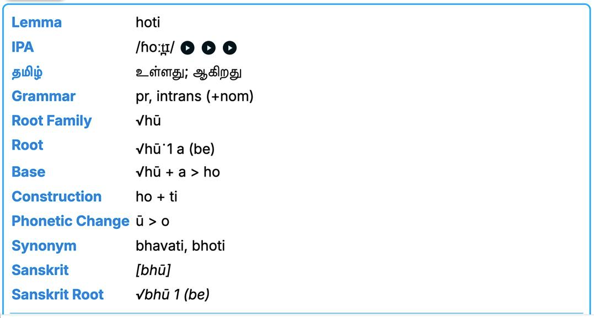
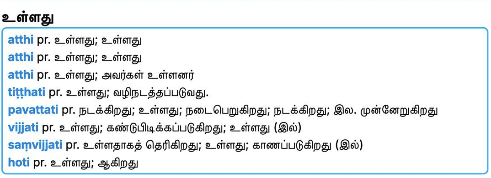

# Digital Pāḷi Dictionary with Tamil language

UNDER DEVELOPMENT

An extended version of the [Digital Pāḷi Dictionary](https://digitalpalidictionary.github.io/) now includes Tamil translations of the English meanings.

## Key Features:

- Tamil Meaning: In the “grammar” tab, you can view the additional Tamil translation of the English meaning.

 

- Tamil-Pāli Dictionary: If you search for a Tamil word, it will display its corresponding Pāli equivalents.

 

Download the latest update in various formats:
- for [GoldenDict](https://github.com/sasanarakkha/dpd-db-sbs/releases/latest/download/dpd+ta-goldendict.zip)
- for [MDict](https://github.com/sasanarakkha/dpd-db-sbs/releases/latest/download/dpd+ta-mdict.zip)

---

This work is based on the [DPD by Ven. Bodhirasa](https://digitalpalidictionary.github.io/), which is a work in progress and regularly updated. For clearer and more accurate information, please install updates regularly.

Instructions for installing Goldendict and MDict can be found on the [original DPD website](https://digitalpalidictionary.github.io/titlepage.html).
