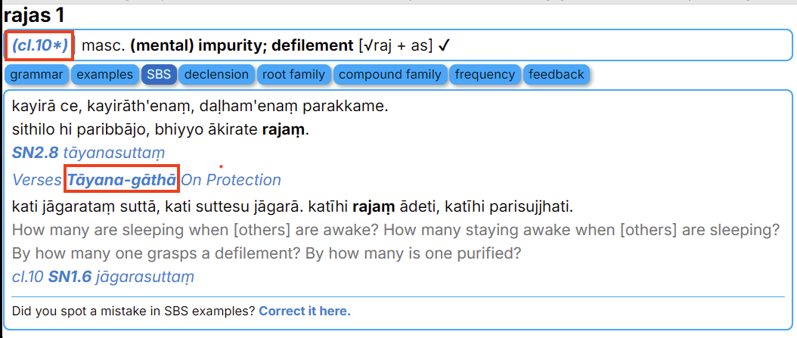

# Digital Pāḷi Dictionary with SBS examples

UNDER DEVELOPMENT

An extended version of the [Digital Pāḷi Dictionary](https://digitalpalidictionary.github.io/) with examples and references specific to SBS Pāli study materials.

## Key Features:

- Targeted Examples: Additional information and references are included only for words that appear in SBS Pāli study materials.

- Integrated Links: Direct access to SBS resources, such as grammatical analyses, recitations, and sutta studies, tied to relevant dictionary entries.

Download the latest update in various formats:
- for [GoldenDict](https://github.com/sasanarakkha/dpd-db-sbs/releases/latest/download/dpd+sbs-goldendict.zip)
- for [MDict](https://github.com/sasanarakkha/dpd-db-sbs/releases/latest/download/dpd+sbs-mdict.zip)

### Additions:

In addition to all the [features of DPD](https://digitalpalidictionary.github.io/features.html), this extended version dictionary provides targeted information related to SBS projects. These enhancements are available only for words that occur in SBS Pāli materials, including: 

- [SBS Pāli Classes](https://digitalpalidictionary.github.io/dpd-pali-courses/bpc/): Grammatical analyses of all words found in SBS Pāli classes (e.g. click on [*(cl. 10)*](https://digitalpalidictionary.github.io/dpd-pali-courses/bpc_key/10_class/)). If you encounter the symbol `*` (e.g. cl. 10*), it indicates that the word is from the Extra part of the exercises for the class. Also it includes English translation as it in the Key to Exercises.

- [Pāli-English Recitations](../6-pali-class/sbs-per-analysis.md): Detailed studies of words from SBS Pāli-English Recitations (e.g. click on [*Tāyana-gāthā*](../6-pali-class/sbs-per-analysis/per-15-on-protection.md)).

 

This work is based on the [DPD by Ven. Bodhirasa](https://digitalpalidictionary.github.io/), which is a work in progress and regularly updated. For clearer and more accurate information, please install updates regularly.

Instructions for installing Goldendict and MDict can be found on the [original DPD website](https://digitalpalidictionary.github.io/titlepage.html).
