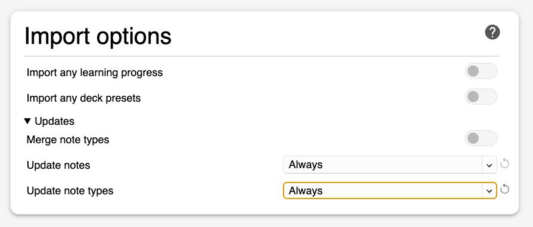
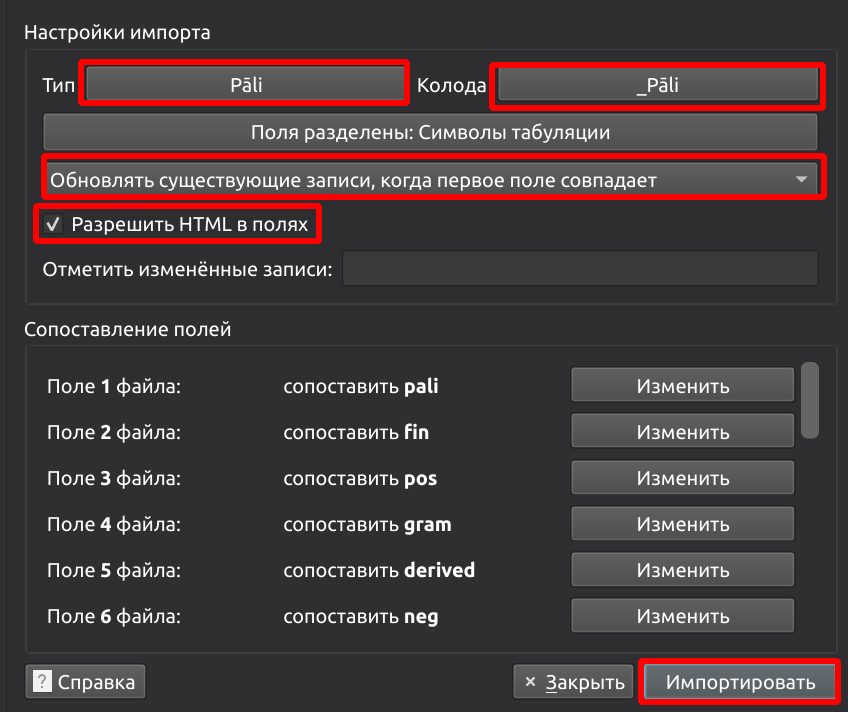

# Пали Словарь

ПРОЕКТ В РАЗРАБОТКЕ

Удобрый интрумент для запоминания слов на пали. Анки версия [Пали словаря](https://devamitta.github.io/dpd.rus/). Колода доступна для тестирования и [отзывов](https://docs.google.com/forms/d/1iMD9sCSWFfJAFCFYuG9HRIyrr9KFRy0nAOVApM998wM/viewform?usp=pp_url&entry.1433863141=ПалиСловарь)
Не забывайте регулярно загружать свежую версию.

- **[Загрузить последнее обновление](https://github.com/sasanarakkha/study-tools/releases/latest/download/ru-pali-vocab.apkg)**

- Дважды щелкните загруженный файл, и он появится в Анки.

# Обновление существующей колоды с сохранением статистики

Обычно достаточно просто дважды щелкнуть по загруженному файлу ru-pali-vocab.apkg, и он обновится в Анки.

- также нужно [удалить повторяющиеся слова](ru-test.md)

# Дополнение Special Fields

Если у вас возникают проблемы с обновлением вашей колоды, попробуйте установить [Special fields Add-on](../general/special-fields.md). Устанавливайте его только в том случае, если вы исчерпали все другие варианты.

# Другой метод обновления

Для тех, у кого возникают трудности с обновлением колоды Anki простым нажатием на файл .apkg, существует надежный, но немного сложный способ обновления. Этот метод особенно полезен для пользователей с очень старыми версиями колоды.

- скачать последний файл csv [здесь](https://github.com/sasanarakkha/study-tools/releases/latest/download/ru-pali-vocab.csv).

- в Anki нажмите **Файл - Импортировать**

- выберите загруженный файл ru-pali-vocab.apkg

- выберите Тип - Pali; Колода - Pali; Обновить существующие записи, когда первое поле совпадает ; Разрешить HTML в полях

- дважды проверьте все с этой картинкой и нажмите **Импортировать**

- также нужно [удалить повторяющиеся слова](ru-test.md)
