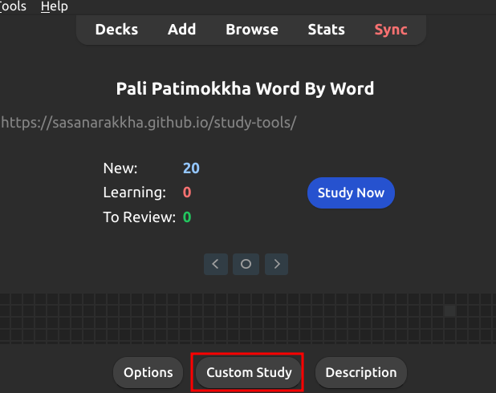
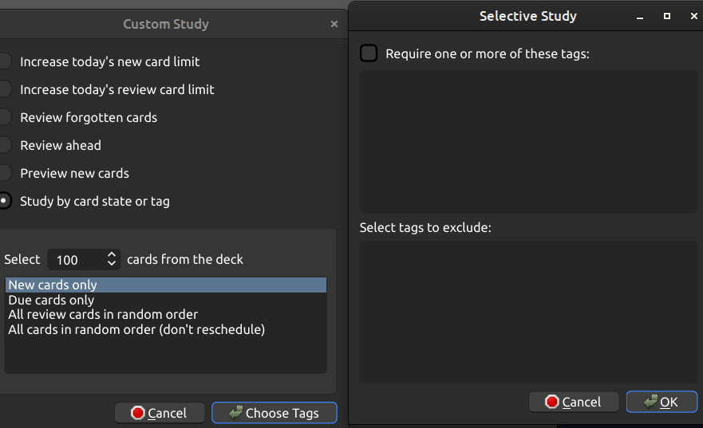
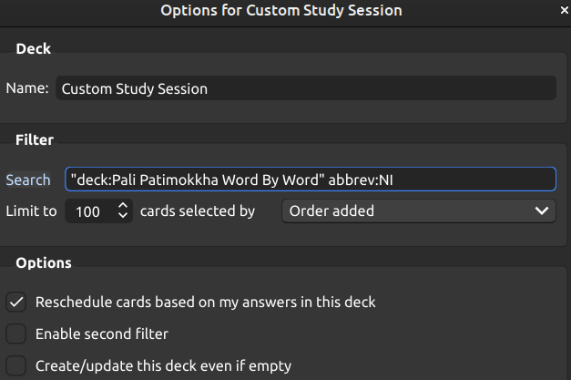

# Review or study words that meet specific criteria

Create a **Custom study** for current deck

The idea is to create any **Custom study** for now. For example choose *Study by card state", and simply click "OK" without selecting any tags.

Go to **Option** of this **Custom study** and adjust the *search* fieldto find the words you need, for example: 

`"deck:Pali Patimokkha Word By Word" abbrev:NI`

This will filter all words from the current deck that are from Nidāna

After finishing your study, don't forget to "Empty" this deck. This will return all cards to the original deck and keep the statistics.

Watch this [short video](https://github.com/user-attachments/assets/acff310b-463e-4c24-854d-d7006994d239) to learn how to do it.

[Back to this deck](1-patimokkha-word-by-word.md)