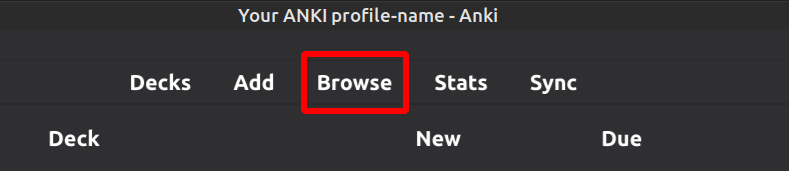
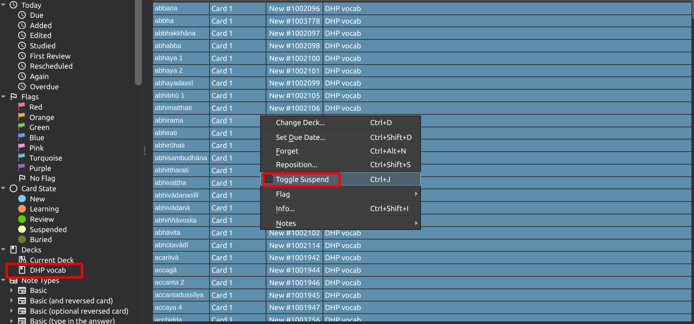

# Recommended way of studying this deck

- First read a selected vagga from the Dhammapada in the Pāḷi and in [the analysis](https://buddhism.lib.ntu.edu.tw/DLMBS/en/lesson/pali/lesson_pali3.jsp)
- In Anki go to **Browse**

- Select the deck **DHP Vocab** in the left panel
- Select all cards with **Ctrl + A**
- Right click and choose **Toggle Suspend** (Ctrl + J)

Now all cards are inactive for study.

- Select the deck **DHP Vocab** in the left panel
- Select the vagga by searching for the name of the vagga (e.g. appamādavaggo) in this deck or just the number of the Dhammapada verse (e.g. 016)
- Select all cards with **Ctrl + A**
- Right click and choose **Toggle Suspend** (Ctrl + J)

Now all cards from the selected vagga will appear in your Anki daily routine. After you finish them, you may repeat the process with another vagga and so on.

[Back to this deck](1-dhp-vocab.md)
