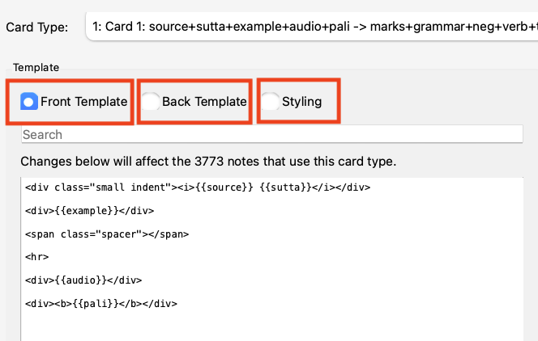

# Advanced: Updating with CSV

For users with very old versions of the deck or those who have trouble updating with the `.apkg` file, this method is more reliable but complex.

## Step 1: Download the CSV Files

Download the latest `.csv` file for your deck from the links below:

- [SBS Pāḷi-English Vocab](https://github.com/sasanarakkha/study-tools/releases/latest/download/sbs-pd.csv)
- [Pātimokkha Word By Word](https://github.com/sasanarakkha/study-tools/releases/latest/download/patimokkha-word-by-word.csv)
- [Bhikkhu Vibhaṅga](https://github.com/sasanarakkha/study-tools/releases/latest/download/vibhanga.csv)
- [DHP Vocab](https://github.com/sasanarakkha/study-tools/releases/latest/download/dhp-vocab.csv)
- [Suttas Advanced Pāli Class](https://github.com/sasanarakkha/study-tools/releases/latest/download/suttas-advanced-pali-class.csv)
- [Parittas](https://github.com/sasanarakkha/study-tools/releases/latest/download/parittas.csv)

## Step 2: Verify Field Lists

Before importing, you must ensure your local field names exactly match the current versions. Go to **Tools > Manage Note Types** to verify.

Compare your current field list with the [most recent list](../../index.md) associated with the deck you’re updating.

## Step 3: Check Card Settings

Ensure your **Front Template**, **Back Template**, and **Styling** match the [latest versions](../../index.md).

## Step 4: Perform the Import

1. In Anki, go to **File > Import**.
   
2. Choose the downloaded `.csv` file.
3. Configure the import settings:
    - **Existing notes:** Update
    - **Match scope:** Note type
   
4. Double-check your settings and click **Import**.

After importing, don't forget to [remove outdated words](updating.md#removing-outdated-words).

---

Back to [Anki Decks Overview](../../index.md).
