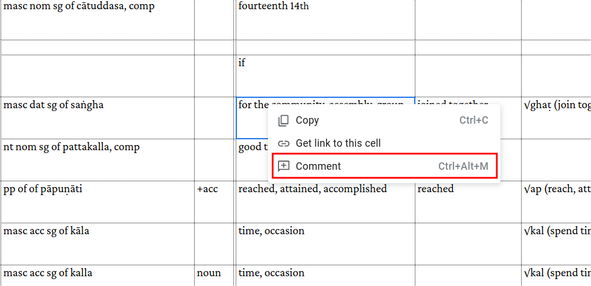

# Pātimokkha Word By Word - Anki deck

UNDER DEVELOPMENT

This is the word by word analysis of the version of the Bhikkhu Pāṭimokkha is based on the comparative study done by Ñāṇatusita in his book ["The Bhikkhu Patimokkha - Word by Word Translation by Bhikkhu Ñāṇatusita."](https://www.bps.lk/olib/bp/bp626s_Nyanatusita_Analysis-of-Bhikkhu-Patimokkha.pdf)

It is recommended to study this pack together with the [Bhikkhu Vibhaṅga](https://suttacentral.net/pitaka/vinaya/pli-tv-vi/pli-tv-bu-vb) and The Bhikkhu Patimokkha - Word by Word Translation by Bhikkhu Ñāṇatusita.

Analysis of the Bhikkhupātimokkha you can see and comment [here](https://docs.google.com/spreadsheets/d/1rS-IlX4DvKmnBO58KON37eVnOZqwfkG-ot-zIjCuzH4/).

or use analysis in [HTML](https://sasanarakkha.github.io/study-tools/bhikkhu_patimokkha/main.html) format.

You can use [second sheet](https://docs.google.com/spreadsheets/d/1rS-IlX4DvKmnBO58KON37eVnOZqwfkG-ot-zIjCuzH4/edit#gid=1448457199) of that analisis as an exercise book.

If you want to understand the Pātimokkha rules more deeply, you can use the [Anki deck of Vibhaṅga](vibhanga.md), which contains pāli words from definitions of Pātimokkha words.

It is available for testing and [feedback](https://docs.google.com/forms/d/e/1FAIpQLSdG6zKDtlwibtrX-cbKVn4WmIs8miH4VnuJvb7f94plCDKJyA/viewform), thanks to Venerable Bodhirasa.

- [Download the latest update](https://github.com/sasanarakkha/study-tools/releases/latest/download/patimokkha-word-by-word.apkg)

- Install [Anki](https://apps.ankiweb.net/)

- Double-click on the downloaded file patimokkha-word-by-word.apkg, and it will appear in your Anki.

# Review or study words that meet specific criteria

Create a **Custom study** for current deck

The idea is to create any **Custom study** for now. For example choose *Study by card state", and simply click "OK" without selecting any tags.

Go to **Option** of this **Custom study** and adjust the *search* fieldto find the words you need, for example: 

`"deck:Pali Patimokkha Word By Word" abbrev:NI`

This will filter all words from the current deck that are from Nidāna

After finishing your study, don't forget to "Empty" this deck. This will return all cards to the original deck and keep the statistics.

Watch this [short video](https://github.com/user-attachments/assets/acff310b-463e-4c24-854d-d7006994d239) to learn how to do it.

## Study Tools & Maintenance

- [How to Update Your Decks](updating.md)
- [Suspending "Extra" Vocabulary](suspend-extra.md)
- [Advanced: Updating with CSV](csv-update.md)
- [Special Fields Add-on](special-fields.md)
