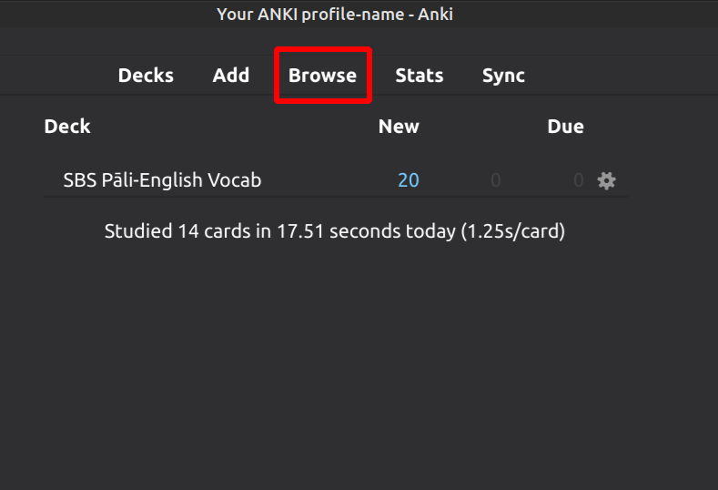
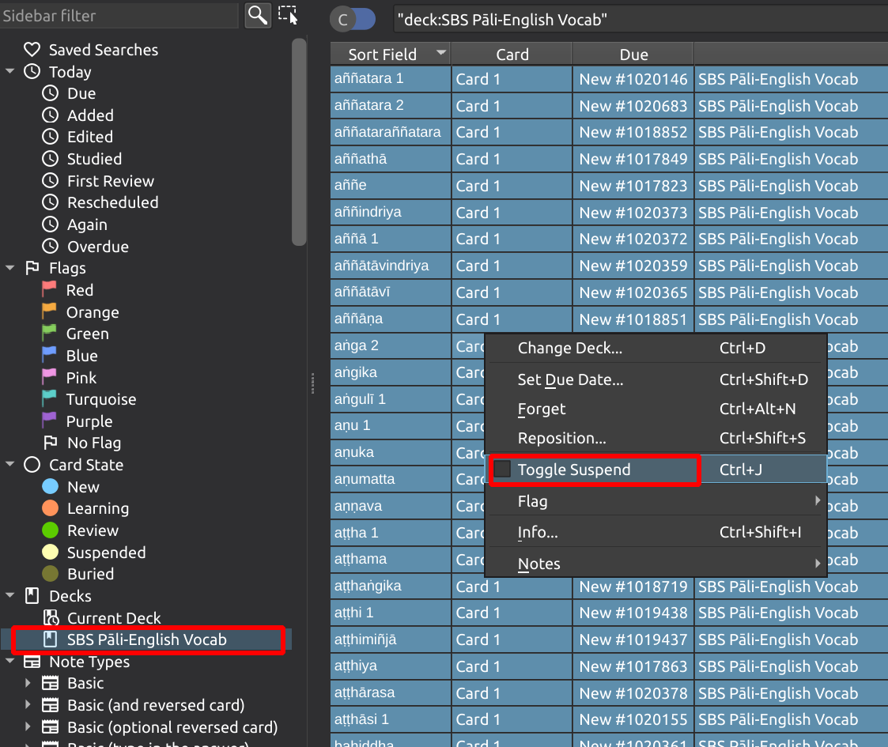
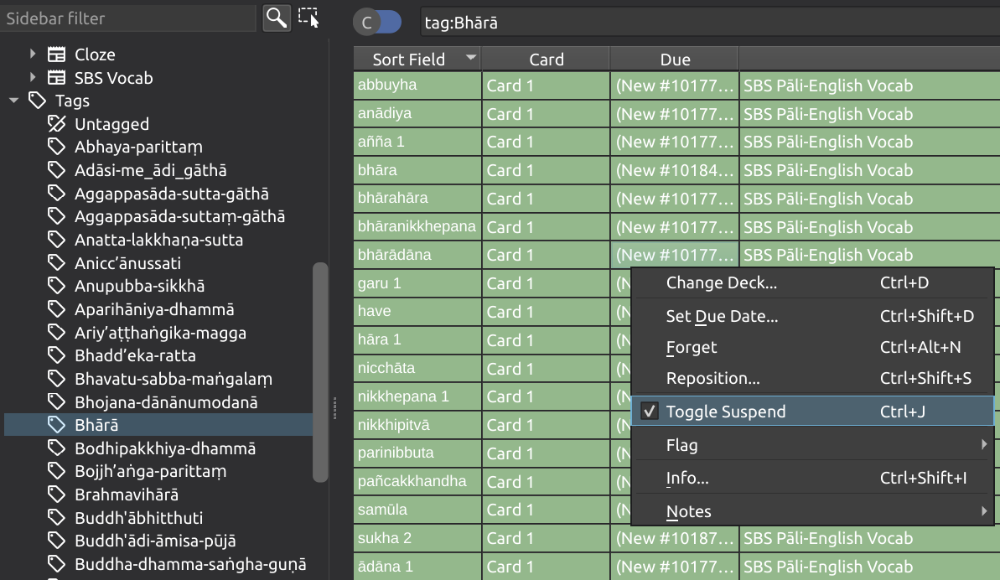

# SBS Pāḷi-English Vocab - Anki Deck

UNDER DEVELOPMENT

Made for the memorization of words from 'SBS Pāḷi-English Recitations'. It is available for testing and [feedback](https://docs.google.com/forms/d/e/1FAIpQLScNC5v2gQbBCM3giXfYIib9zrp-WMzwJuf_iVXEMX2re4BFFw/viewform?usp=pp_url&entry.1433863141=SBS-study-tools). Be sure to regularly download the latest content here.

This tool is recommended to be used together with [SBS Pāḷi-English Recitations](https://sasanarakkha.org/2019/09/08/sbs-pali-english-recitations/); the [Analysis of SBS Pāḷi-English Recitations](../sbs-per-analysis.md) and the [DPD with SBS examples](../dict/sbs-pali-dictionary.md).

Also, as a reference [Word by Word Analysis of SBS Anumodana made by Ven. Ṭhanuttamo](https://docs.google.com/document/d/1qOjSvYnNt1FpMRZdq-vXRMQFH6uTdoYU5hWUN6AP5Hs/) can be made use of.

- **[Download the latest update](https://github.com/sasanarakkha/study-tools/releases/latest/download/sbs-pali-english-vocab.apkg)**

- Install [Anki](https://apps.ankiweb.net/)

- Double-click on the downloaded file SBS Pāḷi-English Vocab.apkg and it will appear in your Anki.

# Recommended ways of studying this deck:

1) **Use the order of the Recitation Book.**

- Read analysis of the first chant. 
- Then study words from this chant. 
- After this, go to the next chant. 
- Better to go with order of the Recitation Book.

Benefits: you will cover all words consistently.

2) **Study chants that you are interested.**

Using this method you are at risk to lose some words, because they have been added in order of the Recitation Book, and if the word appear later it is not always added again.
- Read the analysis of the chant that you like to study. 
- in Anki go to **Browse**

- Select deck **SBS Pāḷi-English Vocab** in the left panel
- Select all card by **Ctrl + A**
- Right click and choose **Toggle Suspend** (Ctrl + J)

Now all cards are inactive for study.

- Select chant which you want to study among tags in the left panel
- Select all card by **Ctrl + A**
- Right click and choose **Toggle Suspend** (Ctrl + J) 

Now all cards from the selected chant will appear in your Anki daily routine. After you finish them, you may repeat the process with another chant and so on.

- If English is not your first language, it is always recommended to translate words to your native language. For this, there is an empty field called "native", that you can fill. And even with next update, this field still will keep all your info. Unless you are using one of the [available language add-ons](native.md) for SBS decks.

## Study Tools & Maintenance

- [How to Update Your Decks](updating.md)
- [Suspending "Extra" Vocabulary](suspend-extra.md)
- [Advanced: Updating with CSV](csv-update.md)
- [Special Fields Add-on](special-fields.md)
