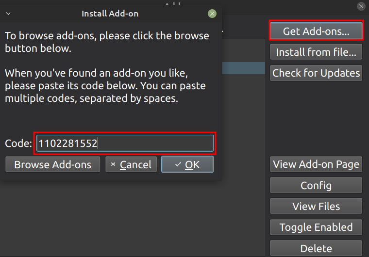
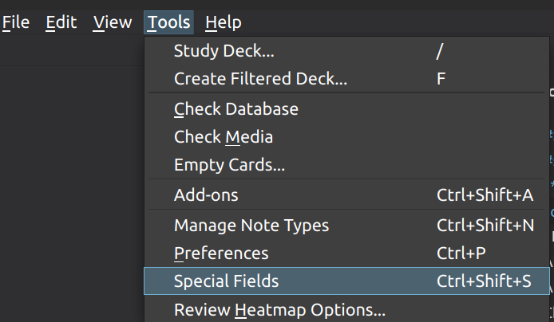
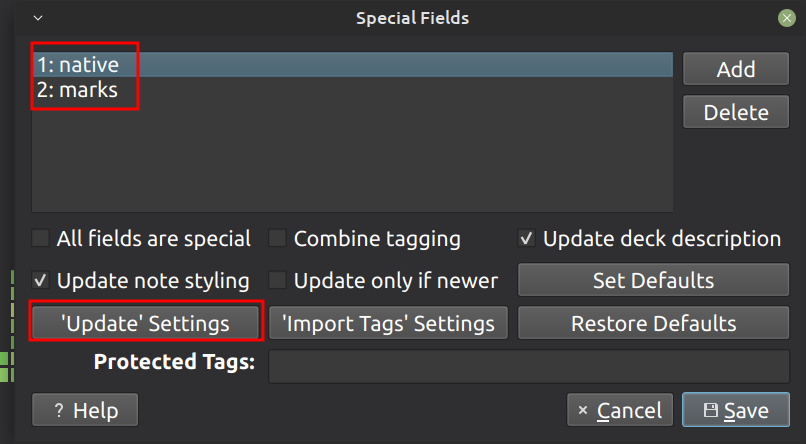

<h1>Add-on special fields</h1>

This add-on makes updating Anki decks smoother. Please use it only if you have a very old version of the deck and are experiencing difficulties with updating it. By default it is easier without this add-on.

Open **Anki > Tools > Add-ons**

You can check [page](https://ankiweb.net/shared/info/1102281552) of Add-on "special fields"

Click **Get Add-ons > 1102281552 > OK**

restart Anki

open settings of Add-on special fields **Tools > Special Fields**

click **'Update' Settings**

also, if you like to protect fields which you edit yourself, like **native** or **marks** - you may add them, and Add-on will protect them while next update.

For more details how to use this add-on see small [video](https://youtu.be/TTHpODHBk3U).

Now you can update your decks.
