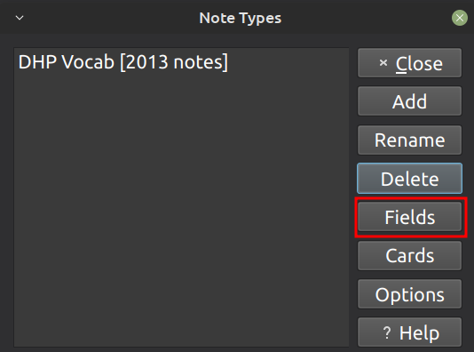
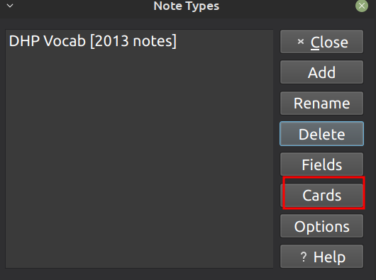
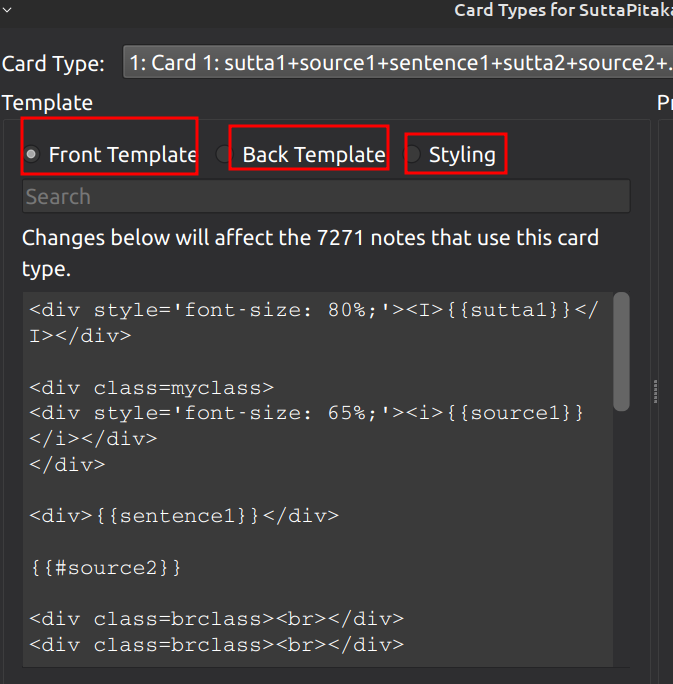
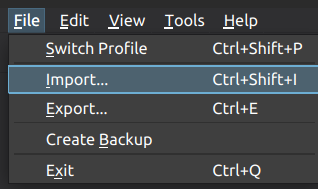

# Anki decks for Pāli Class

Download the latest update of the decks:

- [Vocab Pāli Class](https://github.com/sasanarakkha/study-tools/releases/latest/download/vocab-pali-class.apkg)

- [Grammar Pāli Class](https://github.com/sasanarakkha/study-tools/releases/latest/download/grammar-pali-class.apkg)

- [Common Roots](https://github.com/sasanarakkha/study-tools/releases/latest/download/common-roots.apkg)

- [Phonetic Changes](https://github.com/sasanarakkha/study-tools/releases/latest/download/phonetic-pali-class.apkg)

- [Roots](https://github.com/sasanarakkha/study-tools/releases/latest/download/roots-pali-class.apkg).

- [Suttas Advanced Pāli Class](https://github.com/sasanarakkha/study-tools/releases/latest/download/suttas-advanced-pali-class.apkg)

# Suspend "extra" cards from Vocab deck

Approximately one-quarter of the words in the vocabulary are derived from "Extra" part of the exercises. If you don’t want to study them, you can suspend them in your Anki.
Here’s how you can suspend all extra cards in your “Vocab” Anki deck: open the Browse tab, select the Anki deck you want from the right-hand side, and add it to the search field.

"deck:Vocab Pali Class" extra:_*

Next, select all the cards and click “Toggle suspend”.

# Updating existing deck without losing your statistics

__! Important !__ Before doing anything, synchronize your collection across all your Anki devices. Go to **Tools > Preferences > Syncing** and enable "*On next sync force changes in one direction*". This will provide a secure backup on the Anki cloud in case of any issues.

Usually, it’s sufficient to double-click on the downloaded APKG file, and it will update in your Anki. Please ensure that your import settings are as follows.

Only you need to [remove outdated words](../anki-decks/test.md)

# Special fields add-on

If you're having trouble updating your deck, consider trying the [Special Fields Add-on](../anki-decks/special-fields.md). Only install it if you've exhausted all other options.

# Another method of updating

For those who have trouble updating Anki decks by simply clicking on the .apkg file, there is a reliable but somewhat complicated method for updating. This is especially useful for users with very old versions of the deck.

- download the latest csv file:

- [Vocab Pāli Class](https://github.com/sasanarakkha/study-tools/releases/latest/download/vocab-pali-class.csv)

- Grammar Pāli Class has 3 note types:

- - [note:pali class abbrev](https://github.com/sasanarakkha/study-tools/releases/latest/download/grammar-pali-class-abbr.csv)

- - [note:pali class Grammar](https://github.com/sasanarakkha/study-tools/releases/latest/download/grammar-pali-class-gramm.csv)

- - [note:pali class Sandhi](https://github.com/sasanarakkha/study-tools/releases/latest/download/grammar-pali-class-sandhi.csv)

- [Roots](https://github.com/sasanarakkha/study-tools/releases/latest/download/roots-pali-class.csv)

- [Phonetic Changes](https://github.com/sasanarakkha/study-tools/releases/latest/download/phonetic-pali-class.csv)

- [Suttas Advanced Pāli Class](https://github.com/sasanarakkha/study-tools/releases/latest/download/suttas-advanced-pali-class.csv)

- [Common Roots](https://github.com/sasanarakkha/study-tools/releases/latest/download/common-roots.csv)

- make sure that your filed list exectly the same as current:

- - [filed list for Vocab deck](../anki/field-list-vocab-class.md). 

- - [filed list for Root and Phonetic Changes deck](../anki/field-list-roots-class.md).

- - [filed list for Grammar note:pali class abbrev](../anki/field-list-grammar-abbr.md).

- - [filed list for Grammar note:pali class Grammar](../anki/field-list-grammar-gramm.md).

- - [filed list for Grammar note:pali class Sandhi](../anki/field-list-grammar-sandhi.md).

- - [filed list for Suttas Advanced deck](../anki/field-list-suttas-class.md). 

- - [filed list for Common Roots deck](../anki/field-list-common-roots.md). 

You can check it in menu: **Tools > Manage Note Types**

- make sure that your card settings exectly the same as current card settings. You can check it in menu: **Tools > Manage Note Types**

### for Vocab deck:

- Please note that there are 3 different fields for card settings: 
1. [Vocab FRONT TEMPLATE](../anki/class-front.md)
2. [Vocab BACK TEMPLATE](../anki/class-back.md)
3. [Vocab STYLE](../anki/styling.md) 

### for Grammar deck:

#### note:pali class Grammar

Please note that there are 2 types of card:
- Forth:
1. [Grammar-Forth FRONT TEMPLATE](../anki/grammar-gramm-forth-front.md)
2. [Grammar-Forth BACK TEMPLATE](../anki/grammar-gramm-forth-back.md)
- Back (Reverse):
1. [Grammar-Reverse FRONT TEMPLATE](../anki/grammar-gramm-back-front.md)
2. [Grammar-Reverse BACK TEMPLATE](../anki/grammar-gramm-back-back.md)

#### note:pali class Sandhi

Please note that there are 2 types of card:
- Forth:
1. [Sandhi-Forth FRONT TEMPLATE](../anki/grammar-sandhi-forth-front.md)
2. [Sandhi-Forth BACK TEMPLATE](../anki/grammar-sandhi-forth-back.md)
- Back (Reverse):
1. [Sandhi-Reverse FRONT TEMPLATE](../anki/grammar-sandhi-back-front.md)
2. [Sandhi-Reverse BACK TEMPLATE](../anki/grammar-sandhi-back-back.md)

#### note:pali class Abbrev

1. [Abbrev FRONT TEMPLATE](../anki/grammar-abbrev-front.md)
2. [Abbrev BACK TEMPLATE](../anki/grammar-abbrev-back.md)

- And style is the same for all:
1. [Grammar STYLE](../anki/styling.md) 

### for Root and Phonetic Changes decks:
- Please note that there are 3 different fields for card settings: 
1. [Root FRONT TEMPLATE](../anki/roots-front.md)
2. [Root BACK TEMPLATE](../anki/roots-back.md)
3. [Root STYLE](../anki/styling.md) 

### for Suttas Advanced deck:
- Please note that there are 3 different fields for card settings: 
1. [Root FRONT TEMPLATE](../anki/suttas-front.md)
2. [Root BACK TEMPLATE](../anki/suttas-back.md)
3. [Root STYLE](../anki/styling.md)

### for Common Roots deck:
- Please note that there are 3 different fields for card settings: 
1. [Root FRONT TEMPLATE](../anki/common-roots-front.md)
2. [Root BACK TEMPLATE](../anki/common-roots-back.md)
3. [Root STYLE](../anki/styling.md) 

Check that each of them matches current card settings.
- 

- in the Anki click on **File - Import**

- choose downloaded *.csv

- choose the Notetype and Deck you wish to update; Existing notes - Update; Match scope - Notetype

- double check everything, and click **import**

- now you are up-to-date.

- also make sure to [remove outdated words](../anki-decks/test.md)

